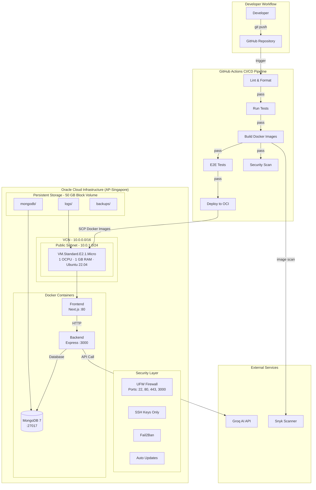

# BrainBytes Deployment Architecture



## Component Relationships

| Component | Connects To | Protocol | Purpose |
|-----------|------------|----------|---------|
| User's Browser | Frontend (:80) | HTTPS | Web UI |
| Frontend (Next.js) | Backend (:3000) | HTTP | API calls |
| Backend (Express) | MongoDB (:27017) | MongoDB Wire | Data persistence |
| Backend (Express) | Groq API | HTTPS | AI responses |
| GitHub Actions | OCI Instance | SSH/SCP | Deployment |

## Network Flow

```
Internet → [Security List: 80, 443, 3000] → UFW → Docker Containers
                                                            ↓
                                              Block Volume (50 GB)
                                                    ↓
                                         MongoDB Data / Logs / Backups
```
