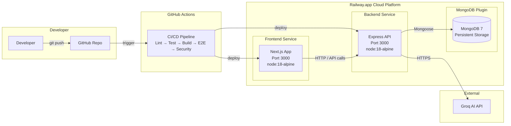

# BrainBytes Deployment Architecture

## System Architecture Overview



## Data Flow

```
User's Browser
      │
      ▼
Railway Frontend (Next.js) ───→ Railway Backend (Express) ───→ Railway MongoDB
      │                              │
      │                              ▼
      │                         Groq AI API
      │
  Auto SSL        Internal Network       Managed Database
  (Railway)       (Railway DNS)          (Railway Plugin)
```

## Service Communication

| From | To | Protocol | How |
|------|----|----------|-----|
| Browser | Frontend | HTTPS | Railway auto-provides URL + SSL |
| Frontend | Backend | HTTP | Railway internal URL env var |
| Backend | MongoDB | MongoDB Wire | Railway plugin connection string |
| Backend | Groq API | HTTPS | External API call |

## Security Layers

| Layer | Protection |
|-------|------------|
| Transport | Auto SSL/HTTPS (Railway-managed) |
| Secrets | Encrypted env vars (Railway) |
| Network | Internal service networking (no public DB) |
| API | Input validation in Express routes |
| CORS | Restricted to frontend origin in production |
